# Git Assignment 1

This is git assignment 1 by Naimul Ferdous

# Git Reset and Interactive Rebase

## Git Reset Commands

### Soft Reset
```bash
# Undo last commit but keep changes staged
git reset --soft HEAD~1

# Undo multiple commits
git reset --soft HEAD~n  # where n is number of commits
```

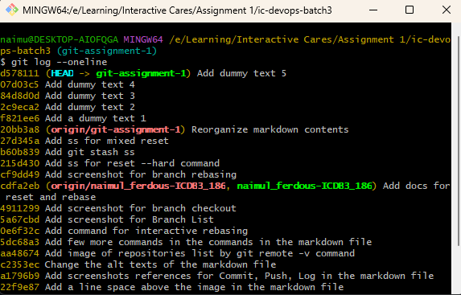

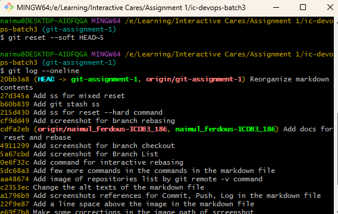


- Moves HEAD to previous commit
- Keeps all changes staged
- Use case: Redoing commits or combining multiple commits

### Mixed Reset (Default)
```bash
# Undo last commit and unstage changes
git reset HEAD~1
# or
git reset --mixed HEAD~1

# Unstage specific file
git reset HEAD file.txt
```

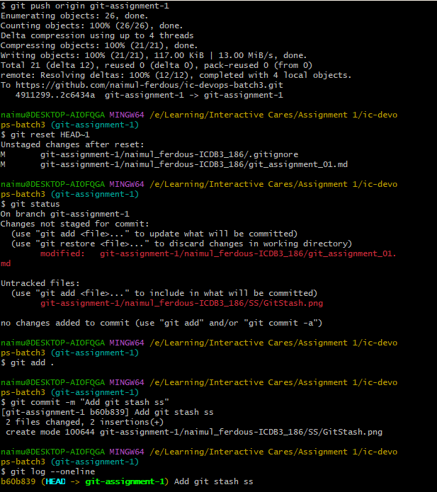


- Moves HEAD and unstages changes
- Files remain modified in working directory
- Use case: Reorganizing changes into different commits

### Hard Reset
```bash
# Completely discard commits and changes
git reset --hard HEAD~1

# Reset to remote branch
git reset --hard origin/main

# Reset to specific commit
git reset --hard commit_hash
```

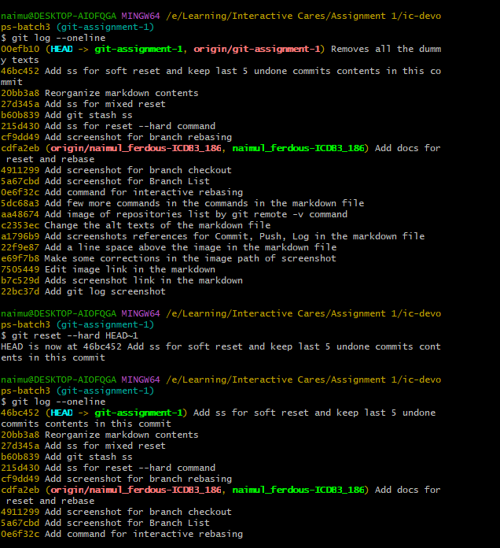

- ⚠️ WARNING: Permanently removes changes
- Moves HEAD and discards all changes
- Use case: Abandoning work and starting fresh

## Git Interactive Rebase

### Basic Interactive Rebase
```bash
# Start interactive rebase for last n commits
git rebase -i HEAD~n

# Rebase onto specific branch
git rebase -i main

# Rebase onto specific commit
git rebase -i commit_hash
```

### Common Rebase Commands
During interactive rebase, you can use these commands:

- `pick` - Keep commit as is
- `reword` - Change commit message
- `edit` - Stop for amending
- `squash` - Melt into previous commit
- `fixup` - Like squash, but discard message
- `drop` - Remove commit


### Example Rebase Scenarios

1. Squashing commits:
```bash
# Squash last 3 commits
git rebase -i HEAD~3
# Then change 'pick' to 'squash' or 's' for commits to combine
```

2. Editing commit message:
```bash
# Change last commit message
git rebase -i HEAD~1
# Then change 'pick' to 'reword' or 'r'
```

3. Reordering commits:
```bash
# Select range of commits to reorder
git rebase -i HEAD~3
# Then reorder the lines in editor
```

## Best Practices

1. Before Reset/Rebase:
   - Create backup branch: `git branch backup-branch`
   - Only modify unpublished commits
   - Check current status: `git status`

2. Recovery Options:
   - View reset history: `git reflog`
   - Restore to previous state: `git reset --hard HEAD@{n}`

   

   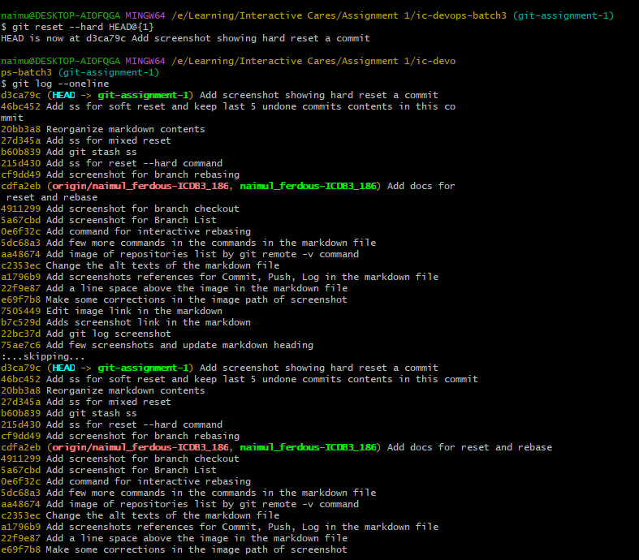

3. When to Use What:
   - Use `--soft` when keeping changes is important
   - Use `--mixed` for reorganizing changes
   - Use `--hard` only when sure about discarding changes
   - Use `rebase -i` for cleaning history before sharing

## Common Pitfalls to Avoid

1. Never reset/rebase public branches
2. Don't reset/rebase without a backup
3. Be careful with `--hard` reset
4. Always check branch status before operations

## Tips

1. Use `git log` to verify commit history
2. Use `git status` frequently during operations
3. Keep commits atomic and focused
4. Write clear commit messages
5. Create backup branches for safety

## Basic Commands

- `git init`: Initialize a new Git repository in the current directory.
- `git clone <repository-url>`: Clone an existing Git repository from a remote URL.
- `git add <file>`: Stage changes in the specified file for the next commit.
- `git add .`: Stage all changes in the current directory for the next commit.

    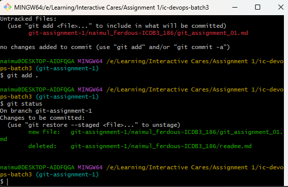

- `git commit -m "commit message"`: Create a new commit with the staged changes and the provided commit message.

    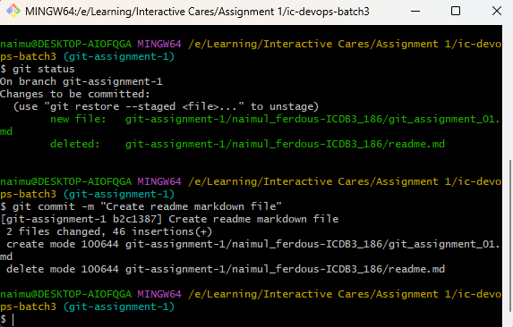

- `git push`: Upload the local repository changes to the remote repository.

    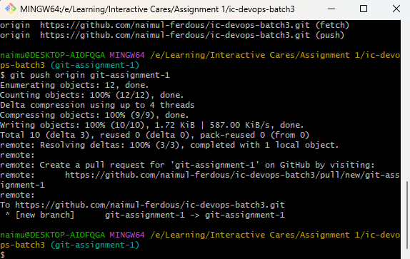

- `git pull`: Download the latest changes from the remote repository and merge them into the local repository.

## Branching and Merging

- `git branch`: List all local branches.

    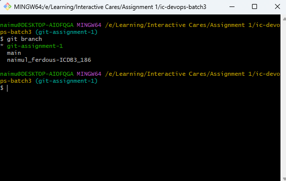

- `git branch <branch-name>`: Create a new branch with the specified name.
- `git checkout <branch-name>`: Switch to the specified branch.

    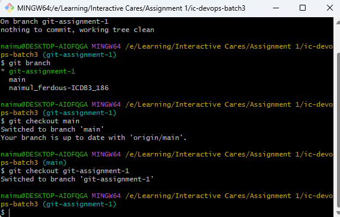

- `git merge <branch-name>`: Merge the specified branch into the current branch.

    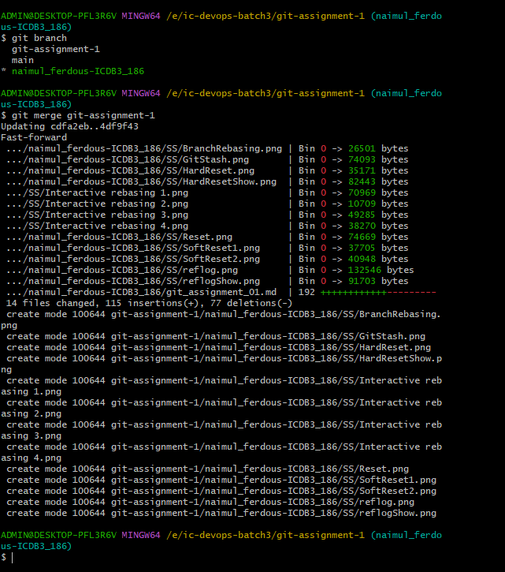

- `git branch -d <branch-name>`: Delete the specified local branch.
- `git push origin :<branch-name>`: Delete the specified remote branch.

## Inspection and Comparison

- `git status`: Show the current status of the repository, including unstaged and untracked files.
- `git log`: Show the commit history of the current branch.

    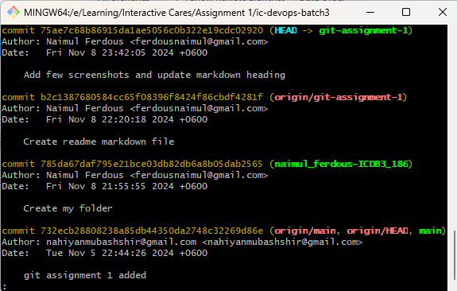

- `git diff`: Show the differences between the working directory and the staging area.
- `git diff <branch1> <branch2>`: Show the differences between two branches.

## Undoing Changes
- `git reset <file>`: Unstage the specified file.
- `git reset --hard`: Discard all changes in the working directory and staging area.

    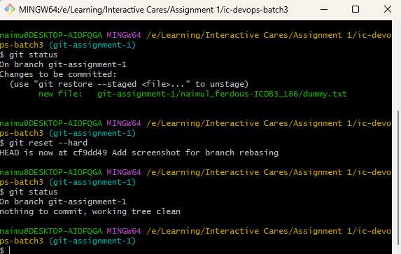

- `git revert <commit-hash>`: Create a new commit that undoes the changes introduced by the specified commit.
- `git checkout -- <file>`: Discard changes in the working directory for the specified file.

## Rebasing and Resetting
- `git rebase <branch>`: Move the current branch's commits to the tip of the specified branch.

    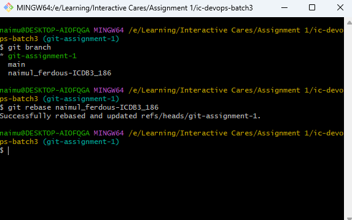

- `git rebase -i <commit-hash>`: Start an interactive rebase session starting from the specified commit.
- `git reset <commit-hash>`: Move the current branch's tip to the specified commit, discarding changes.
- `git reflog`: Show the history of all your repository's previous states.

    

- `git cherry-pick <commit-hash>`: Apply the changes introduced by a specific commit to the current branch.

    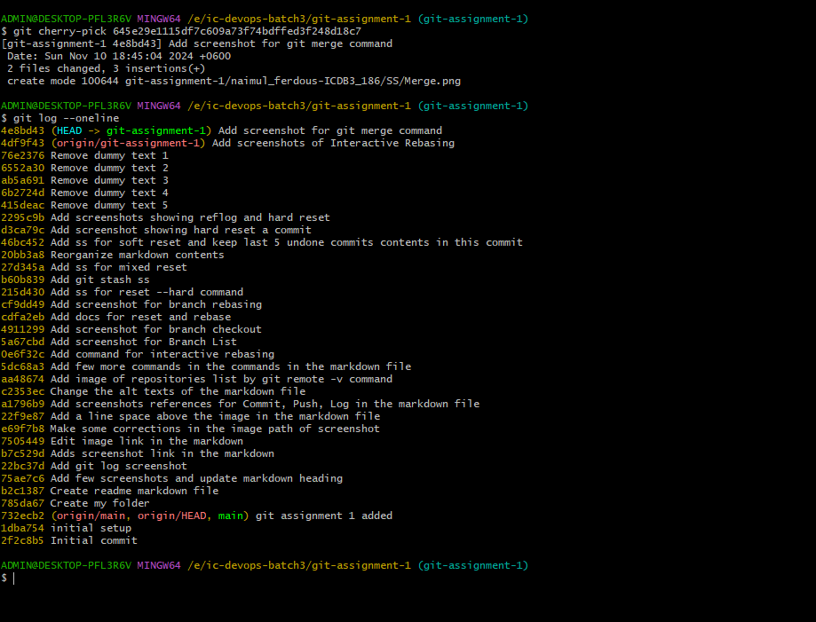

## Stashing
- `git stash`: Save the current state of the working directory and the index, to be restored later.
- `git stash list`: List the current stashes.
- `git stash apply`: Restore the most recent stash.
- `git stash pop`: Restore the most recent stash and remove it from the stash list.
- `git stash drop`: Remove the most recent stash.
This covers t

    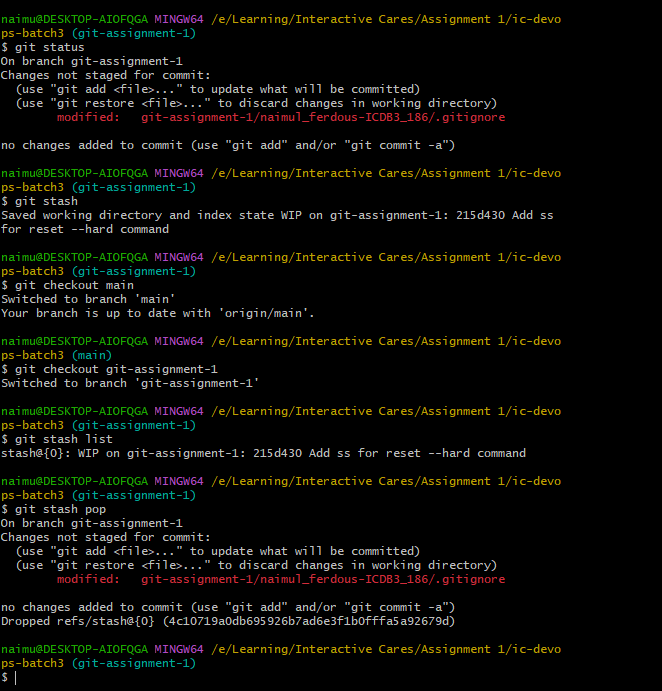

## Remote Repositories

- `git remote add origin <repository-url>`: Add a new remote repository with the name "origin".
- `git remote -v`: Show the configured remote repositories.

    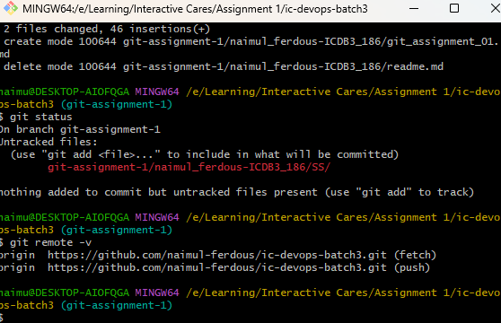

- `git push -u origin <branch-name>`: Push the specified branch to the remote repository and set it as the upstream branch.
- `git fetch`: Download objects and refs from the remote repository without merging them into the local repository.
- `git remote prune origin`: Remove references to remote branches that no longer exist.
